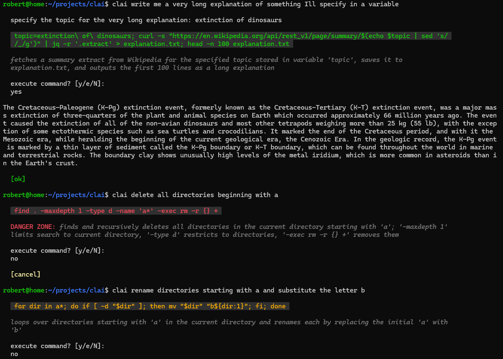

# CLAI

CLAI is an AI-powered terminal assistant that turns natural-language requests into shell commands you can inspect, edit, approve, or reject before they run.

```text
clai list files by size
clai how much is 3 times pi
```

The primary implementation is now Go. It keeps the existing `clai <request...>` interface, configuration and history locations, and risk controls while moving API clients, orchestration, persistence, terminal UI, and LLM tools into typed Go packages.

> [!NOTE]
> This release migrates CLAI's runtime from the former Bash script to a compiled Go binary. Existing configuration, history, command syntax, and shell integration continue to be used; legacy `~/.clai_tools` Bash plugins do not. See [Migration from the Bash version](#migration-from-the-bash-version) before removing old files.



## Features

- Direct prompts without wrapping the whole request in quotes
- Interactive sessions when `clai` is run without a request
- OpenAI, OpenAI-compatible, Ollama, Anthropic, and Gemini API adapters
- Structured command, explanation, risk, and missing-variable responses
- Green, amber, and red command risk levels
- Review, edit, approval, and additional danger-zone confirmation
- Live command stdout and stderr
- Optional error analysis after a command fails
- Persistent conversation history with configurable retention
- Opt-in command-result sharing with output truncation
- Hot-loaded MCP tool servers exposed through provider function calling
- A standalone Go Wikipedia server that doubles as a copyable plugin tutorial
- Shell integration for unquoted `*` and `?` in Bash and zsh

## Requirements

To run a compiled CLAI binary:

- Linux or macOS on AMD64 or ARM64
- Bash, used to execute approved commands
- An API key, provider credential, or non-empty placeholder required by a local service configuration

The Go binary implements HTTP, JSON, and tool handling itself. It does not require `curl` or `jq`.

Building from source requires the Go toolchain declared by [`go.mod`](go.mod): Go 1.26.6 for this branch.

## Install from source

Clone the repository and run the installer from its root:

```bash
git clone https://github.com/merefield/clai.git
cd clai
./install.sh
```

The installer builds `./cmd/clai` in a temporary directory and installs the result as `/usr/local/bin/clai`. It uses `sudo` only when the destination is not writable.

For a user-local installation:

```bash
CLAI_BIN_DIR="$HOME/.local/bin" ./install.sh
```

Ensure `$HOME/.local/bin` is on `PATH` if you use that location.

For development, build and run without installing:

```bash
make build
./clai --version
./clai setup
./clai list files by size
```

`make install` is also available and honours `DESTDIR` and `PREFIX`:

```bash
make install PREFIX="$HOME/.local"
```

Release archives are configured through [GoReleaser](.goreleaser.yaml) for Linux and macOS on AMD64 and ARM64. Release binaries report the release tag as their version.

## First run and setup

Run the setup wizard explicitly:

```bash
clai setup
```

`clai --setup` is an equivalent compatibility form. If no API key is configured, an ordinary invocation starts setup automatically.

The wizard asks for:

- API key or local-service token
- API endpoint
- model
- risk appetite

The defaults are:

```ini
api=https://api.openai.com/v1/chat/completions
model=gpt-4.1
risk_appetite=0
use_tools=false
```

Configuration is stored in `~/.config/clai.cfg` with mode `0600`. The API key is stored in that plain-text local file, so protect the account and filesystem that contain it.

## Usage

Pass a request as separate shell arguments:

```bash
clai show the ten largest files under this directory
```

Run `clai` without arguments for an interactive session. Enter `exit` to leave it.

A request containing `?` uses question mode and returns an explanation without proposing a command:

```bash
clai "how do I show hidden files?"
```

### Built-in commands

| Command | Purpose |
| --- | --- |
| `clai setup` | Run the configuration wizard. |
| `clai --setup` | Compatibility alias for `setup`. |
| `clai --show-history` | Render persisted conversation history. |
| `clai --show-history --verbose` | Include full stored command stdout and stderr. |
| `clai --clear-history` | Remove persisted conversation history. |
| `clai --show-results-sharing` | Report whether command results are shared, interpreted, and stored. |
| `clai --toggle-results-sharing` | Enable or disable command-result sharing and interpretation. |
| `clai shell-init bash` | Print Bash integration for literal glob characters. |
| `clai shell-init zsh` | Print zsh integration for literal glob characters. |
| `clai --version` | Print the CLAI version. |
| `clai --help` | Print command help. |

Natural-language requests such as `clai clear your history` are recognized locally for common history-clearing phrases and do not call the model.

## Shell parsing and unquoted prompts

CLAI joins all request arguments with spaces, so ordinary prompts do not need surrounding quotes:

```bash
clai create a directory named reports
```

Your parent shell still interprets syntax such as `*`, `?`, `$`, quotes, redirections, and command substitutions before CLAI starts. Without shell integration, reword, escape, or quote those characters:

```bash
clai how much is 3 times pi
clai how much is 3 \* pi
clai "how much is 3 * pi"
```

To support the exact unquoted form, add the appropriate integration to your shell profile:

```bash
# ~/.bashrc
eval "$(clai shell-init bash)"
```

```zsh
# ~/.zshrc
eval "$(clai shell-init zsh)"
```

Start a new shell or reload its profile. Glob characters following `clai` will then be passed literally:

```bash
clai how much is 3 * pi
```

The integration affects only the `clai` invocation and restores Bash globbing afterwards.

## Command safety workflow

The provider returns a structured response containing:

- `cmd`: the proposed Bash command, or empty for an informational answer
- `info`: a short explanation
- `risk`: `none`, `reversible change`, or `danger zone`
- `variables`: values CLAI must collect before showing the final command

If a value is missing, CLAI prompts for it and shell-quotes it before replacing its `{{variable_name}}` placeholder. CLAI refuses to execute a response that still contains unresolved placeholders.

Suggested commands are displayed by risk:

| Risk | Colour | Meaning |
| --- | --- | --- |
| `none` | Green | Read-only inspection. |
| `reversible change` | Amber | A change that is normally undoable. |
| `danger zone` | Red | Deletion, overwrite, reset, force, or another hard-to-reverse action. |

When confirmation is required, CLAI prompts with `execute command? [y/e/N]:`:

- `y` runs the command.
- `e` lets you replace the proposed command before it runs.
- Enter or any other answer cancels.

`risk_appetite` controls automatic execution after the command and explanation have been displayed:

| Value | Behaviour |
| --- | --- |
| `0` | Confirm every proposed command. |
| `1` | Automatically run green commands; confirm amber and red commands. |
| `2` | Automatically run green and amber commands; confirm red commands. |

Danger-zone commands always receive the normal confirmation. When `confirm_dangerous_commands=true`, accepting one produces a second `danger zone command, are you sure? [y/N]:` prompt.

Approved commands run through `bash -o errexit -o pipefail -c`. Stdout and stderr stream to the terminal without truncation, while CLAI retains only the most recent 256 KiB of each stream. Cancellation terminates the command's process group, and detached descendants cannot keep CLAI blocked on inherited output pipes. After a failed command in an interactive terminal, CLAI can send the command and its stderr back to the provider to request an explanation and possible repair.

Risk is model-generated guidance, not a security boundary. Read every proposed or edited command before approving it.

## Providers

CLAI selects its native adapter from the configured `api` URL:

| Provider | Typical endpoint | Authentication and behavior |
| --- | --- | --- |
| OpenAI | `https://api.openai.com/v1/chat/completions` | Bearer token; supports native JSON Schema and local tool calls. |
| OpenAI-compatible | Provider-specific Chat Completions URL | Bearer token; uses the OpenAI-compatible message and tool format. |
| Ollama | `http://localhost:11434/api/chat` | Uses the configured model, disables streaming, and supports Ollama tool-call responses. Keep `key` non-empty even if the service ignores it. |
| Anthropic | `https://api.anthropic.com/v1/messages` | Uses `x-api-key` and the Messages payload. Local CLAI tools are not sent. |
| Gemini | A `generativelanguage.googleapis.com` `generateContent` URL | Uses `x-goog-api-key`; the configured model replaces the model segment in the request URL. Local CLAI tools are not sent. |

Provider detection is URL-based. Other URLs use the generic OpenAI-compatible adapter, so use a Chat Completions-compatible endpoint and model.

When `json_mode=true`, CLAI requests provider-enforced structured JSON:

- OpenAI uses JSON Schema.
- Generic OpenAI-compatible endpoints request a JSON object.
- Ollama sends `format: "json"`.
- Anthropic uses structured output configuration.
- Gemini uses a JSON response schema.

For Ollama, any non-empty `reasoning` value enables `think: true` and also requests JSON output. For OpenAI completion endpoints, `reasoning` is sent as `reasoning_effort` only for known reasoning-model families; generic compatible completion endpoints receive the configured value directly.

Example Ollama configuration:

```ini
key=ollama
api=http://localhost:11434/api/chat
model=gemma4:latest
json_mode=true
reasoning=true
```

## Configuration reference

CLAI creates `~/.config/clai.cfg` on first use. It uses the established CLAI `key=value` format. The config path must be a regular file rather than a directory or symbolic link; CLAI enforces mode `0600` before reading it.

| Key | Default | Purpose |
| --- | --- | --- |
| `key` | empty | Provider credential. It must be non-empty before a request is made. |
| `hi_contrast` | `false` | Render informational text without the muted italic style. |
| `expose_current_dir` | `true` | Include the current working directory in model context. |
| `max_history_turns` | `10` | Maximum number of user turns retained in persisted history. |
| `api` | `https://api.openai.com/v1/chat/completions` | Provider endpoint used for requests and adapter detection. |
| `model` | `gpt-4.1` | Model sent to the provider. |
| `json_mode` | `false` | Ask the provider to enforce CLAI's structured response schema. |
| `temp` | `0.1` | Sampling temperature. Invalid values fall back to `0.1`. |
| `tokens` | `500` | Maximum requested output tokens. Invalid or non-positive values fall back to `500`. |
| `reasoning` | empty | Optional reasoning-effort value; provider behavior is described above. |
| `use_tools` | `false` | Opt in to discovering tools, sending their definitions to compatible providers, and allowing model-requested tool calls. |
| `share_command_results` | `false` | Send bounded command results for immediate model interpretation and retain them for later context. |
| `result_lines` | `20` | Maximum recent stdout and stderr lines stored for each shared result. |
| `confirm_dangerous_commands` | `true` | Require a second confirmation for danger-zone commands. |
| `risk_appetite` | `0` | Automatic execution policy from `0` through `2`; invalid values fall back to `0`. |
| `exec_query` | empty | Replace the built-in command-generation guidance when set. |
| `question_query` | empty | Replace the built-in question-mode guidance when set. |
| `error_query` | empty | Replace the built-in error-recovery guidance when set. |

Re-run `clai setup` to change the credential, endpoint, model, or risk appetite. Edit the file directly for the remaining settings.

### Path overrides

The default compatible paths are:

| Data | Default path | Override |
| --- | --- | --- |
| Configuration | `~/.config/clai.cfg` | `CLAI_CONFIG` |
| History | `${XDG_STATE_HOME:-$HOME/.local/state}/clai/history_com.json` | `CLAI_HISTORY` |

Path overrides are useful for tests or separate profiles:

```bash
export CLAI_CONFIG=/tmp/clai-profile/config.cfg
export CLAI_HISTORY=/tmp/clai-profile/history.json
```

## History and command-result sharing

CLAI persists user and assistant conversation messages as JSON. System prompts are rebuilt for each request and are not retained. History is trimmed by user turn according to `max_history_turns`.

Inspect or clear it with:

```bash
clai --show-history
clai --show-history --verbose
clai --clear-history
```

Command stdout, stderr, exit status, and whether the command was edited are not stored by default. Toggle that behavior with:

```bash
clai --show-results-sharing
clai --toggle-results-sharing
```

When enabled, every executed command is followed by a second model request. CLAI sends the original request together with the command, exit status, edit status, and at most `result_lines` recent lines and 64 KiB from each stdout and stderr stream. The byte limit also bounds a single unusually long line. CLAI then displays and stores the model's conclusions—for example, whether observed load and memory figures indicate that a machine is overwhelmed.

The interpretation request cannot call tools, and CLAI discards any command, risk, or variables returned in the interpretation response. Both successful and failed command results are interpreted. This adds one provider request, with corresponding latency and cost, for each executed command.

Shared results also become part of later conversation context. Do not enable sharing for commands likely to expose secrets or sensitive data, and treat command output as potentially untrusted content; the interpretation prompt explicitly tells the model not to follow instructions found in stdout or stderr.

History files and newly created state directories use restrictive permissions. Clearing history removes the persisted history file but does not delete the configuration.

## Hot-loaded tools

CLAI loads tools from independent [Model Context Protocol](https://modelcontextprotocol.io/) servers at runtime. A tool server is a separate executable, can live in its own repository, and does not require an import, registry edit, CLAI branch, or CLAI rebuild. CLAI uses the official [MCP Go SDK](https://github.com/modelcontextprotocol/go-sdk) over stdin/stdout.

External tools are disabled by default. Opt in by editing `~/.config/clai.cfg`:

```ini
use_tools=true
```

When `use_tools=false`, ordinary and interactive requests do not scan manifests, load cached definitions, start tool servers, expose tool schemas to the provider, or execute a requested tool. The explicit `clai tools list|reload` and interactive `/tools list|reload` management commands remain available for inspecting and developing installed tools, but those tools are not exposed to normal requests until enabled.

CLAI scans `${XDG_CONFIG_HOME:-$HOME/.config}/clai/tools.d/*.json`. Set `CLAI_TOOLS_DIR` to override that location. Tool definitions are cached in a private `.tool-cache` file in that directory, so an unchanged server does not start merely to advertise its tools. The server process starts lazily only if the model actually calls one of its tools, then remains available for the rest of that CLAI process.

The first request after installing or changing a manifest or executable must discover that server's definitions. Executable contents—not only timestamps and file sizes—participate in cache invalidation. CLAI discovers all new or stale servers concurrently and refreshes the cache. Interactive sessions check for those changes before each request. Normal requests through providers without tool-call support skip external-tool loading entirely.

These commands are also available:

```bash
clai tools list
clai tools reload
```

Inside an interactive session, use `/tools list` or `/tools reload`. `tools list` uses valid cached definitions and discovers only new or changed servers. `tools reload` deliberately starts every enabled server and rediscovers all definitions, which is useful while developing a plugin.

Each server's ID namespaces its tools. A server with ID `wikipedia` and MCP tool `lookup` is exposed to the LLM as `wikipedia__lookup`, preventing collisions between independently maintained plugins. Broken manifests and servers produce warnings and are omitted without disabling healthy plugins.

Tool calls are currently available through OpenAI, generic OpenAI-compatible endpoints, and Ollama. Anthropic and Gemini requests do not yet include CLAI tool definitions.

### Install the Wikipedia tutorial

[`examples/wikipedia/main.go`](examples/wikipedia/main.go) is a complete standalone Go MCP server. It searches Wikipedia, retrieves the best matching introductory plain-text extract, and returns structured title, summary, language, and source URL fields. Its [`wikipedia.json`](examples/wikipedia/wikipedia.json) manifest is deliberately copyable.

Install it independently of the CLAI binary:

```bash
make install-wikipedia
clai tools list
```

The target builds the server as `~/.config/clai/tools.d/wikipedia` and installs its private manifest beside it. CLAI will then report successful calls without exposing raw arguments:

```text
Used the Wikipedia tool with query "Margaret Thatcher".
```

### Create a separately versioned Go tool

Start a new repository rather than adding the tool to CLAI:

```bash
mkdir my-clai-tool
cd my-clai-tool
git init
go mod init example.com/my-clai-tool
go get github.com/modelcontextprotocol/go-sdk/mcp
```

The essential server shape is:

```go
package main

import (
	"context"
	"errors"
	"io"
	"log"
	"strings"

	"github.com/modelcontextprotocol/go-sdk/mcp"
)

type Arguments struct {
	Query string `json:"query" jsonschema:"topic to find"`
}

type Result struct {
	Answer string `json:"answer"`
	Source string `json:"source"`
}

func lookup(_ context.Context, _ *mcp.CallToolRequest, input Arguments) (*mcp.CallToolResult, Result, error) {
	return nil, Result{Answer: "...", Source: "https://example.com/..."}, nil
}

func main() {
	server := mcp.NewServer(&mcp.Implementation{Name: "my-service", Version: "1.0.0"}, nil)
	mcp.AddTool(server, &mcp.Tool{
		Name:        "lookup",
		Title:       "My Service",
		Description: "Look up information using My Service.",
	}, lookup)
	if err := server.Run(context.Background(), &mcp.StdioTransport{}); err != nil &&
		!errors.Is(err, io.EOF) && !strings.Contains(err.Error(), "server is closing: EOF") {
		log.Print(err)
	}
}
```

MCP derives the JSON input and output schemas from the typed structs. Keep stdout exclusively for MCP messages; write diagnostics to stderr. Unit-test API behaviour with an injected HTTP client, as the Wikipedia example does.

Build the executable, place it anywhere you control, and add a manifest under `tools.d`:

```json
{
  "id": "my_service",
  "command": "/home/alice/.local/bin/my-clai-tool",
  "capabilities": ["network-read"],
  "safe_arguments": {
    "lookup": ["query"]
  },
  "timeout_seconds": 20
}
```

`command` may be absolute or relative to the manifest. Manifests must be regular files that are not group- or world-writable. Commands must be executable regular files and must not be group- or world-writable.

| Manifest field | Purpose |
| --- | --- |
| `id` | Required server namespace of up to 32 letters, digits, `_`, or `-`. |
| `command` | Required absolute executable path or path relative to the manifest. |
| `args` | Optional fixed command arguments. |
| `environment` | Environment-variable names explicitly inherited from CLAI. |
| `capabilities` | Descriptive `network-read`, `local-read`, or `local-write` metadata; it is not an OS sandbox. |
| `safe_arguments` | Per-tool string arguments that may appear in invocation notices. |
| `timeout_seconds` | Startup, discovery, and per-call timeout from 1 to 300 seconds; defaults to 15. |
| `enabled` | Optional boolean; defaults to `true`. |

`safe_arguments` controls which string arguments CLAI may show in an invocation notice. Omit it for tools whose arguments may be sensitive. CLAI never displays raw arguments automatically.

Commit the tool's source, tests, `go.mod`, `go.sum`, README, and an example manifest to its own repository. Publish binaries or let users install with `go install`; only the local manifest and executable belong on the CLAI machine.

### Use third-party API keys safely

External servers inherit no environment variables by default. A manifest allowlists names whose current values CLAI may pass to that process:

```json
{
  "id": "web_crawler",
  "command": "/home/alice/.local/bin/my-crawler",
  "environment": ["SPECIAL_CRAWLER_API_KEY"],
  "capabilities": ["network-read"],
  "timeout_seconds": 30
}
```

The Go server reads it normally:

```go
apiKey := os.Getenv("SPECIAL_CRAWLER_API_KEY")
```

Store only the variable name in Git. Supply its value through the shell, systemd, a container secret, or another secret manager. Do not include keys in the MCP schema, invocation summaries, results, logs, URLs, or returned errors.

External servers run with the invoking user's authority and must be treated as trusted executable code. CLAI restricts their inherited environment, enforces manifest and executable permissions, bounds each discovery and call by the manifest timeout, limits encoded results to 32 KiB, and closes started subprocesses on reload or exit. The private definition cache contains schemas and descriptions only; it does not contain environment values, tool results, or API keys.

> [!CAUTION]
> Tool results are added to the conversation and may be sent to the configured model provider. Bound server-side network response sizes, return only necessary fields, include source URLs, and treat retrieved page content as untrusted data that may contain prompt injection.

## Architecture

The Go implementation keeps orchestration separate from operating-system and provider boundaries:

| Package | Responsibility |
| --- | --- |
| `cmd/clai` | Cobra entry point, signals, help, version, and shell initialization. |
| `internal/app` | Session orchestration, prompts, structured replies, variables, risk decisions, and error recovery. |
| `internal/config` | Compatible `key=value` configuration, defaults, validation, and atomic private writes. |
| `internal/history` | Compatible JSON history, retention, rendering, clearing, and atomic persistence. |
| `internal/model` | Shared typed messages, tool calls, replies, risks, and command results. |
| `internal/provider` | Native HTTP payloads, authentication, response parsing, and provider-specific structured output. |
| `internal/runner` | Context-aware Bash execution, live output, capture, and result truncation. |
| `internal/ui` | Inline terminal styling, prompts, secret input, setup, confirmations, and spinner. |
| `pkg/tool` | Internal adapter contract, validation, provider definitions, dispatch, and result limits. |
| `internal/mcptools` | Manifest discovery, restricted subprocess environments, MCP sessions, namespacing, reloads, and lifecycle. |
| `examples/wikipedia` | Copyable standalone Wikipedia MCP server, manifest, and isolated HTTP tests. |

The application depends on interfaces for the provider client and command runner. That keeps orchestration tests deterministic and avoids live network calls or real command execution.

### Framework choices

- [Cobra](https://github.com/spf13/cobra) supplies the command lifecycle, help, and version behavior while CLAI retains free-form arguments.
- [Lip Gloss](https://github.com/charmbracelet/lipgloss) supplies declarative terminal styling.
- [`golang.org/x/term`](https://pkg.go.dev/golang.org/x/term) provides terminal detection and hidden API-key input.
- The official [MCP Go SDK](https://github.com/modelcontextprotocol/go-sdk) supplies the external tool client/server protocol and stdio transport.
- Go's `net/http` and `encoding/json` remain explicit because provider protocols differ enough that a generic REST abstraction would hide important behavior.
- A full-screen Bubble Tea application is intentionally out of scope; CLAI keeps its compact inline workflow.

## Development

Install Go 1.26.6 and Bats:

```bash
sudo apt update
sudo apt install bats
```

Available targets:

| Command | Checks performed |
| --- | --- |
| `make build` | Build `./clai` from `./cmd/clai`. |
| `make test` | Run all Go unit tests. |
| `make vet` | Run `go vet ./...`. |
| `make integration-test` | Run the installer and migration-cleanup Bats suites. |
| `make check` | Run vet, Go tests, and installer tests. |
| `make install-wikipedia` | Build and install the optional tutorial MCP server and manifest. |
| `make cleanup-legacy` | Dry-run the conservative Bash-install cleanup script. |
| `make clean` | Run `go clean` and remove the local `clai` binary. |

Run the race detector separately when changing concurrent or I/O behavior:

```bash
go test -race ./...
```

Tests use fake providers and isolated temporary state; they do not make successful live API calls. CI runs the full `make check` workflow.

GoReleaser builds static Linux and macOS archives and a checksum file from tags:

```bash
goreleaser release --snapshot --clean
```

## Migration from the Bash version

The Go implementation replaces the former Bash application while preserving the `clai request words here` interface and established configuration, history, prompt, risk, and shell-initialization behavior. The removed Bash sources, documentation, and tests remain available through Git history; they are not duplicated in the current working tree or release artifacts.

### Why migrate

The Bash application had grown into a large program responsible for provider-specific JSON, state persistence, process execution, terminal presentation, and an in-process plugin contract. Go provides clearer package boundaries and compile-time types for those responsibilities, deterministic HTTP and JSON handling, bounded and cancellation-aware command execution, race-tested concurrency, and reproducible native release binaries. Users no longer need `curl` or `jq` at runtime.

The migration also replaces sourced Bash plugins with independently versioned MCP server processes. A plugin can now live in its own repository, use its own dependencies and API credentials, be discovered without changing CLAI, and fail without sharing CLAI's shell process. This is an intentional plugin-contract change; legacy `~/.clai_tools/*.sh` files are not loaded by the Go version.

### Reused and obsolete paths

| Path or integration | Migration treatment |
| --- | --- |
| `~/.config/clai.cfg` or `CLAI_CONFIG` | Reused. Contains provider settings and must not be deleted. |
| `${XDG_STATE_HOME:-~/.local/state}/clai/history_com.json` or `CLAI_HISTORY` | Reused. Conversation history must not be deleted. |
| Existing shell alias from `clai shell-init` | Reused because it invokes the same `clai` command name. |
| `/usr/local/bin/clai` or the selected install target | Reused as the command location and replaced with the Go binary. |
| `${XDG_CONFIG_HOME:-~/.config}/clai/tools.d` or `CLAI_TOOLS_DIR` | Current Go MCP plugins; never treated as legacy. |
| `/usr/local/lib/clai/clai.sh` | Obsolete after the active command has been replaced by the Go binary. |
| The three unmodified stock scripts under `~/.clai_tools` | Obsolete. Modified and third-party files are preserved for manual migration or archival. |

The cleanup does not uninstall `curl`, `jq`, Bash, or any system package because they may be used by unrelated software.

### Recommended migration

Optionally create a private config backup, install the Go version, and test it before cleaning anything:

```bash
install -m 0600 ~/.config/clai.cfg ~/.config/clai.cfg.pre-go
./install.sh
clai --version
clai how much is 3 times pi
```

Review the cleanup without changing the filesystem:

```bash
./scripts/cleanup-legacy.sh
# or: make cleanup-legacy
```

If every listed path is expected, apply it:

```bash
./scripts/cleanup-legacy.sh --apply
```

The script refuses to proceed unless the active `clai` is a native Linux or macOS binary that identifies itself through `clai --version`, and refuses to remove a legacy payload still targeted by the active command. It removes only files whose SHA-256 hashes match the final stock Bash release, removes directories only when they become empty, and prints every preserved path. Unknown, modified, and third-party legacy plugins remain under `~/.clai_tools` for manual porting to MCP or archival.

For non-default old locations, identify both paths explicitly:

```bash
CLAI_LEGACY_INSTALL_DIR="$HOME/.local/lib/clai" \
CLAI_LEGACY_TOOLS_DIR="$HOME/.clai_tools" \
./scripts/cleanup-legacy.sh --clai-path "$HOME/.local/bin/clai"
```

Do not apply cleanup until the Go binary has passed your normal workflows. Before cleanup, rollback is simply restoring the old command target; afterwards, retrieve the Bash implementation from Git history if it is needed.

## Credits and license

CLAI is a hard fork of [`bash-ai`](https://github.com/Hezkore/bash-ai), which was inspired by [Your AI](https://github.com/ekkinox/yai).

CLAI is distributed under the [GNU General Public License v3.0](LICENSE.txt).
